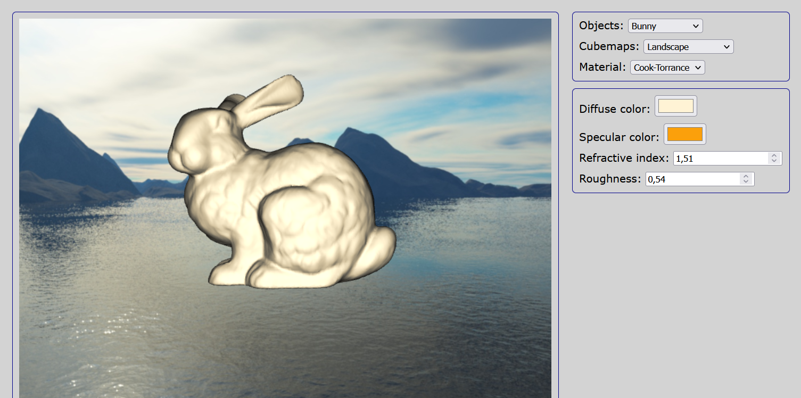

# 3D Web Visualizer

<p align=center>
  
</p>

## Description

A fundamental 3D web app implemented to study and experiment the Cook-Torrance microfacet model for local illumination and reflection mapping using *WebGL* and fragment shaders in *GLSL*.

Three materials are available:

* Cook-Torrance: *Cook-Torrance* model with Lambert diffuse (*Beckmann* NDF and *V-cavities* GAF)
* Mirror
* Transparency: Adding partial refraction using *Fresnel*

## Use

This program is compatible with *Mozilla Firefox* web browser (tests on other web browsers aren't done).

To launch it: Just open ```main.html``` in Firefox.

However, you may need to enable hard disk research for JavaScript local files through Firefox options (or you'll probably won't be able to see anything at all inside the canvas).

To achieve this:

1. Access Firefox options by entering ```about:config``` in the address bar
2. At that point, you may encounter a warning message from Firefox that prevents modifications for safety purposes: Accept and continue
3. Look for option ```security.fileuri.strict_origin_policy``` and set the boolean to ```False```
4. Finally, remember to reverse the state of the option to ```True``` later

Camera orientation and zoom is performed using the mouse inside the canvas:

* Use and hold the left mouse button to rotate the camera
* Use the mousewheel to zoom in and out fast
* Use and hold the keyboard ```SHIFT``` key + the left mouse button to zoom in and out smoothly

You can control the roughness, as well as the refractive index.

Roughness is only used for Cook-Torrance material:

* A low value will make the reflected light less scattered (the model seems shinier)
* A high value will make the model more blurry, more matte 

Refractive index value is used to determine how much the light is bent when entering a surface.

For example, the refractive index for glass is ```1.5168```.

This online database can be used as a reference to find meaningful numbers:
<https://refractiveindex.info/>.

Other parameters are self-explanatory.

<!-- OLD DESCRIPTION
The main goal of this university project (2021) was to implement simple reflectance models via shaders for photorealistic rendering purpose.
Three aspects where approached:
- The interaction of light on a 3D model
- The Cook-Torrance model, with Beckmann Normal Distribution and Torrance-Sparrow GAF
- The reflections and refractions on a 3D model, computed with an environment map (cubemap)

The program is compatible with Mozilla Firefox. You may need to enable hard disk research for JS files through Firefox options:

```
- access to browser options with "about:config" in address bar
- search for "security.fileuri.strict_origin_policy" and reverse the state of the boolean (set it to False)
```
-->
